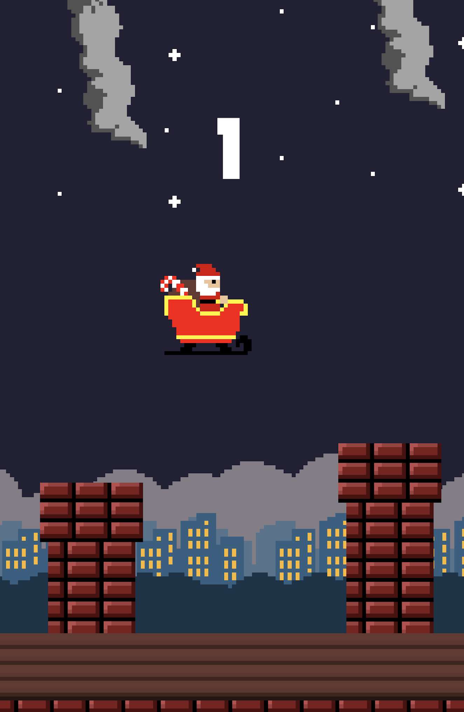

# Robot Jump

Robot jump is a game similar to 'Doodle Jump'. The premise is to get as high as you can by moving left and right up a series of platforms.

### Technical Information
Robot jump is written in **C#** using **Unity**. It was primarily compiled as a WebGL game, but could be adapted to Android/PC/Mac fairly easily in the future.

